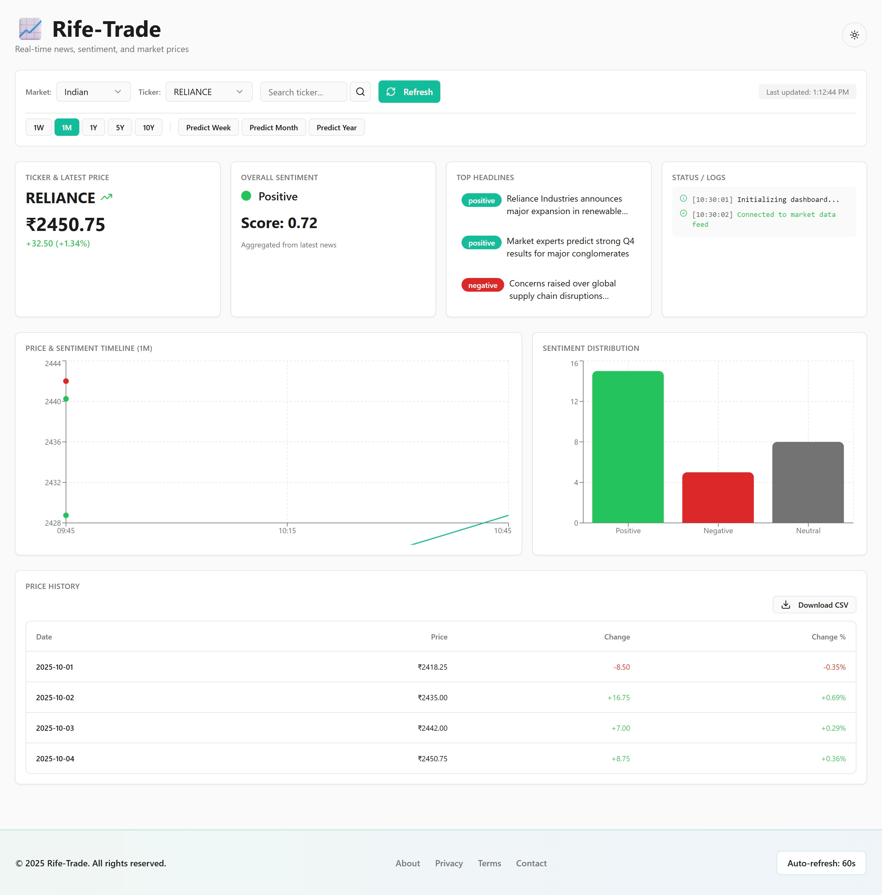

# Rife-Trade 
LLM + embeddings powered market insights dashboard — ingest news & price data, surface succinct trading-relevant insights and explainable signals.


## Overview
Rife Trade is an AI-powered market analysis platform that combines real-time market data with sentiment analysis from news sources to provide actionable insights for traders and investors.

## Features (Planned)
- 📈 Real-time market data for major indices and stocks
- 📰 News aggregation with sentiment analysis
- 🤖 AI-powered market insights using local LLM (Ollama)
- 📊 Interactive dashboard with visualizations
- 🔔 Custom alerts and notifications

## Tech Stack
- **Backend**: FastAPI
- **Frontend**: Streamlit (sample dashboard shown above)
- **AI/ML**: Ollama (local LLM), Transformers
- **Data**: yfinance, NewsAPI
- **Database**: (To be implemented)

## Getting Started

### Prerequisites
- Python 3.8+
- Ollama installed and running locally
- NewsAPI key (for news features)

### Installation
1. Clone the repository
2. Install dependencies:
   ```bash
   pip install -r requirements.txt
   ```
3. Create a `.env` file with your API keys
4. Start the backend server:
   ```bash
   uvicorn app:app --reload
   ```

## Project Status
🚧 Under Active Development

## License
MIT

---

## Project outcome (what is in this repo skeleton)

* `notebooks/RifeTrade_notebook.ipynb` — end-to-end notebook (data → embeddings → index → retrieval → results + mini backtest). *Skeleton included below.*
* `app/streamlit_app.py` — small Streamlit dashboard to demo: enter ticker → fetch price → retrieve top news → summarise → show signals.
* `data/sample_news.csv` — a tiny example dataset so the app works out-of-box.
* `requirements.txt` — pip install list.
* `README.md` — polished project description (this doc), demo script, and interview bullets.

---

## Architecture (high level)

1. **Data ingestion** — price via `yfinance`, news via NewsAPI / web-scraper or uploaded CSV.
2. **Preprocessing** — simple text cleaning & timestamp alignment.
3. **Embeddings & index** — `sentence-transformers` (all-MiniLM) → FAISS index.
4. **Retrieval** — nearest-neighbours + filter by ticker/date.
5. **LLM summarization / Q&A** — HF `pipeline('summarization')` or small instruction model.
6. **Frontend** — Streamlit app that calls the retrieval + summarizer pipeline.
7. **(Optional)** lightweight backtest of a simple sentiment rule on historical price data.

---

## Notebook skeleton (`notebooks/RifeTrade_notebook.ipynb`)

* Cells:

  1. Title & imports
  2. Load sample data (or Kaggle dataset if you have it)
  3. EDA & quick charts
  4. Build embeddings (sentence-transformers)
  5. Build FAISS index & retrieval examples
  6. Summarization / LLM prompt examples
  7. Simple backtest: turn a summarizer-sentiment into a long/flat rule and compute cumulative returns
  8. Conclusions & next steps

---



> **Note:** The dashboard shown above is a sample implementation with test data. The project is currently under active development and will be ready soon with more features and real-time data integration.